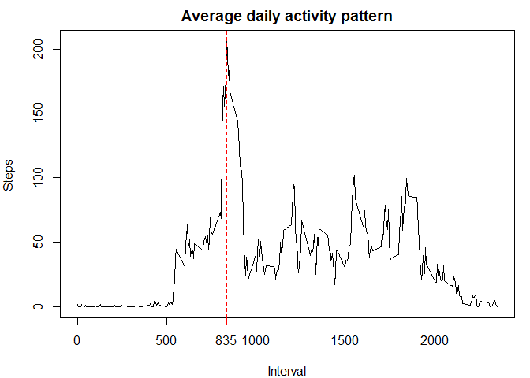
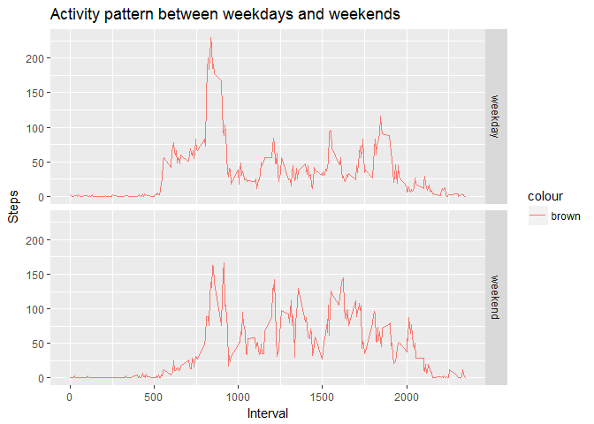

# PA1_template.Rmd
Jithin Raj R  
July 10, 2017  

##loading data


```r
download.file("https://d396qusza40orc.cloudfront.net/repdata%2Fdata%2Factivity.zip", "./data")
unzip("data")
activity <- read.csv(file = "activity.csv")
activity$date <- as.Date(activity$date, "%Y-%m-%d")
```


##Mean total number of steps taken per day
### NA values are ignored


```r
temp <- activity[complete.cases(activity),]
total.steps <- aggregate(temp$steps, by = list(temp$date), sum)
names(total.steps) <- c("date", "steps")
hist(total.steps$steps, xlab = "steps per day", main = "Total number of steps taken per day")
```

<!-- -->

```r
mean.steps <- mean(total.steps$steps)
median.steps <- median(total.steps$steps)
```
Mean and Medain of total number of steps taken per day are 1.0766189\times 10^{4} and 10765 respectively.

## Average Daily Activity Pattern


```r
par(mar= c(4,4,2,1))
pattern <- aggregate(temp$steps, by= list(temp$interval), mean)
names(pattern) <- c("interval", "steps")
plot(x= pattern$interval, y= pattern$steps, type = "l", xlab = "Interval", ylab = "Steps ", main = "Average daily activity pattern")
max.interval <- pattern$interval[which(pattern$steps== max(pattern$steps))]
abline(v= max.interval, col= "red", lty= 2)
axis(1, at= max.interval, labels = max.interval, col = "blue", col.ticks = "red")
```

<!-- -->


The 5-minute interval having maximum number of steps is 835.

## Imputing missing values
### NA values are replaced with  mean for that 5-minute interval values


```r
 row.na <- sum(is.na(activity))

# creating new data set 
fn <- function(x)
 {
   pattern[pattern$interval == x,2]
}
new.activity <- activity[,c(1,2,3)]
new.activity[is.na(new.activity),1] <-  sapply(new.activity[is.na(new.activity),]$interval, fn)

#histogram of the total number of steps taken each day 
new.total.steps <- aggregate(new.activity$steps, by = list(new.activity$date), sum)
names(new.total.steps) <- c("date", "steps")
hist(new.total.steps$steps, xlab ="steps", main = "steps taken each day" )
```

<!-- -->


### Effect of imputing on total daily number of steps

```r
new.mean.steps <- mean(as.numeric(new.total.steps$steps))
new.median.steps <- median(as.numeric(new.total.steps$steps))
delta.mean <- new.mean.steps- mean.steps
delta.median <- new.median.steps - median.steps
```
Mean and Median of total number of steps taken per day after imputing are 1.0766189\times 10^{4} and 1.0766189\times 10^{4} respectively.

change in mean is 0 and change median is 1.1886792. Median of total number of steps has increased after imputing, while mean is unchanged.


### Activity patterns between weekdays and weekends


```r
# creating factor variable
new.activity$day <- factor(ifelse(weekdays(new.activity$date) == "Saturday" |weekdays(new.activity$date) == "Sunday", "weekend", "weekday" ))

#applying aggregate fn

day.steps <- aggregate(new.activity$steps, by =list(new.activity$interval,new.activity$day), mean) 
names(day.steps) <- c("interval", "day", "steps")

# making panel plot using ggplot2
library(ggplot2)
g <- ggplot(data = day.steps, aes(x= day.steps$interval, y = day.steps$steps, col="brown"))
g+geom_line()+facet_grid(facets = day.steps$day~.)+labs( x="Interval", y = "Steps", title ="Activity pattern between weekdays and weekends")
```

<!-- -->

